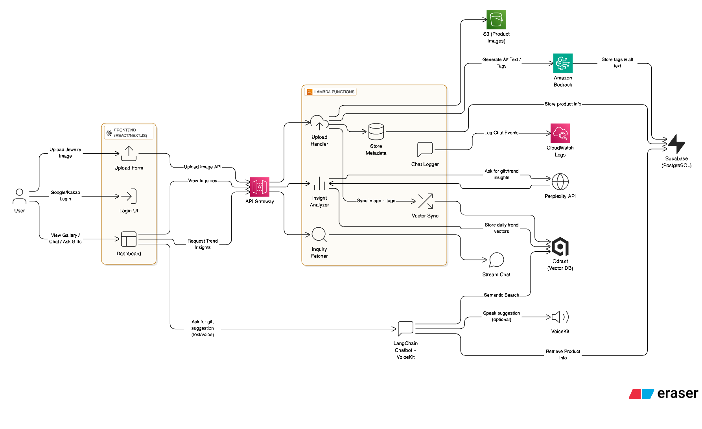

# Lunova App

## Modern Jewelry & Souvenir E-commerce Platform

Lunova is a full-stack e-commerce application for premium jewelry and souvenirs, built with a **serverless-first architecture** to ensure scalability, cost-efficiency, and rapid development.

### Serverless Architecture

The application leverages a comprehensive serverless stack:

- **Frontend**: React with Vite, deployed on Netlify's serverless functions
- **Authentication**: Supabase Auth (serverless JWT authentication)
- **Database**: PostgreSQL on Supabase (serverless database)
- **API Layer**: 
  - Supabase Edge Functions for core functionality
  - FastAPI on serverless containers for high-performance product operations
- **Storage**: Supabase Storage for media assets (serverless object storage)
- **Real-time Features**: Supabase Realtime for live updates and notifications

### Architecture Diagram


*Lunova App Architecture Overview*

### Key Features

- Multi-language support (English/Japanese)
- Responsive dashboard with product and ticket management
- User settings with customizable preferences
- Weather integration via OpenWeather API
- Secure authentication and user management
- Comprehensive product catalog with advanced filtering
- AI-powered product suggestions and virtual shop assistant

### Project Status

See our [Task Checklist](./task-checklist.md) for completed features and upcoming development plans.

### Why Lunova could be a start-up idea

Lunova represents a compelling startup opportunity in the luxury e-commerce space for several reasons:

- **AI-Powered Shopping Experience**: The integration of OpenAI and vector search creates a personalized shopping assistant that understands customer needs in multiple languages.

- **Serverless Architecture**: The serverless-first approach ensures scalability while keeping operational costs low, perfect for a growing startup.

- **Multi-language Support**: Built-in internationalization opens markets across different regions, particularly targeting English and Asian language speakers.

- **Luxury Market Focus**: Targeting the high-margin luxury jewelry and souvenir market creates opportunities for premium pricing and brand positioning.

- **Data-Driven Insights**: The integration of market insights and analytics provides shop owners with valuable business intelligence.

- **Modular Design**: The micro-frontend architecture allows for rapid feature development and easy scaling of the team and product.

### Tech Stack

- **Frontend**: React, TypeScript, TailwindCSS
- **Backend**: Supabase, FastAPI (Python)
- **Deployment**: Vercel, Render
- **APIs**: RESTful API with FastAPI, Supabase

### Getting Started

```bash
# Install dependencies
npm install

# Start development server
npm run dev

# For API development
cd blazingfast-api
pip install -r requirements.txt
python main.py
```

### Serverless Benefits

Our serverless approach provides:

- **Cost Optimization**: Pay only for actual usage
- **Auto-scaling**: Handles traffic spikes without manual intervention
- **Reduced DevOps**: No server management or maintenance
- **Global Availability**: Distributed across edge locations for low latency
- **Rapid Development**: Focus on code, not infrastructure
